<div align="center">

# 💸 Dana-Cermat

**Smart personal finance tracking for students.**
Know where your money goes, before it's gone.


[Live Demo](#) · [Report Bug](../../issues) · [Request Feature](../../issues)

<!-- TODO: ganti ss1.png dengan screenshot terbaik lo -->
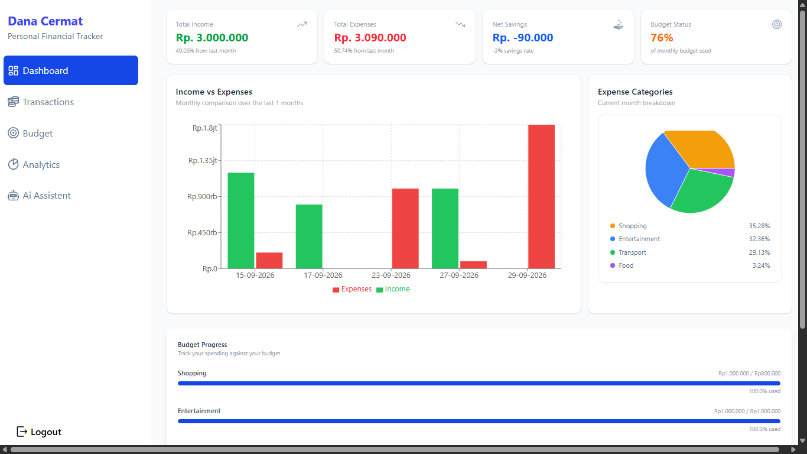

</div>

---

## 📖 About

This project was inspired by a problem I personally faced in managing my finances.

Hi, I'm Raffy. I'm a student who moved away from a small hometown to study in a big city. Living far from my family, I struggled to manage and control my personal finances, especially when it came to setting spending priorities, tracking income and expenses, and setting aside money for future needs.

That experience taught me that managing money as a student isn't just about knowing how much you have. It's about how you allocate it wisely.

That's why Dana-Cermat is built around the **70:30 principle**: **70%** of your income goes to daily needs and expenses, while **30%** is set aside for savings or other financial goals.

My hope is that students, especially those living away from home, can use this app to build more organized financial habits, keep their spending under control, get a clearer picture of their financial condition, and consistently save a portion of their money.

More than just a tool for recording transactions, Dana-Cermat is a **personal financial management tool** that helps students make more deliberate financial decisions.

## ✨ Features

### 🔐 Authentication & Security
- **Email & password authentication** with passwords hashed using **bcrypt**
- **OAuth login** for quick sign-in with a third-party account
- **JWT-based authentication** for stateless, secure API access
- **Session management** to keep users signed in safely
- **Forgot password flow**: a verification code is sent to the user's email via **SMTP**

### ⚙️ Backend
- **RESTful API** built with Node.js and Express.js
- **MVC architecture** for a clean, maintainable codebase
- **MySQL** relational database

### 🎨 Frontend
- **React.js** single-page application with reusable components
- **React Hook Form + Zod** for fast, type-safe form validation
- **Recharts** for interactive charts and financial visualizations
- **Tailwind CSS** for a responsive, modern UI
- **Receipt-themed landing page** with a custom carousel

## 📸 Screenshots

<table>
  <tr>
    <td>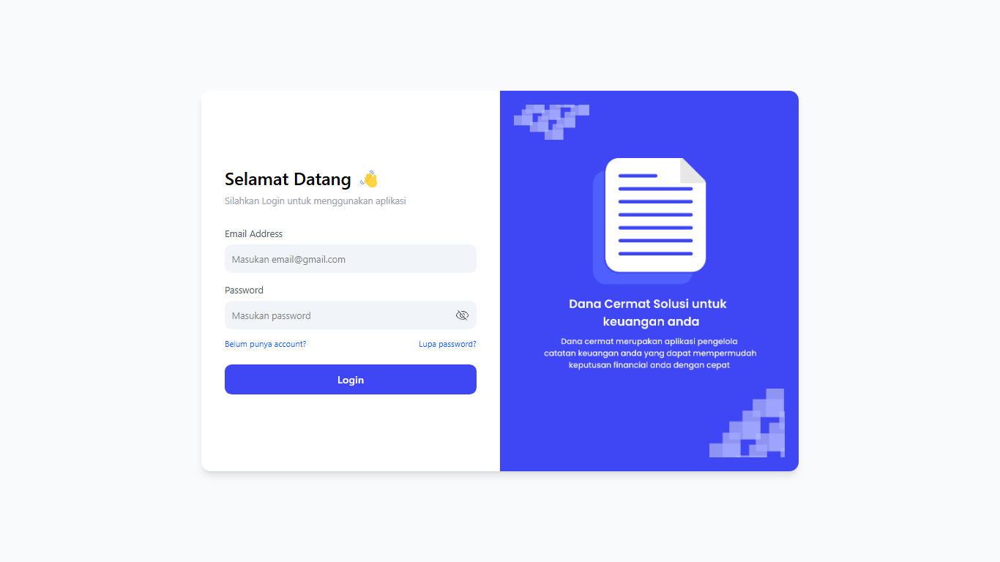</td>
    <td>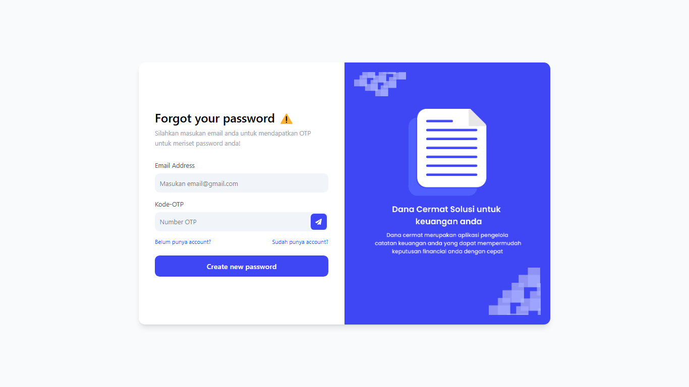</td>
    <td>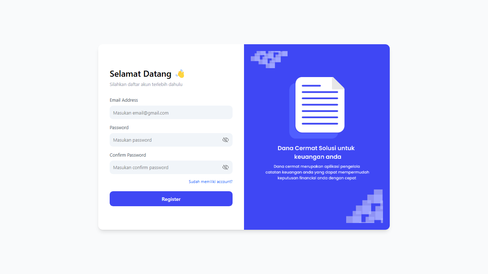</td>
  </tr>
  <tr>
    <td>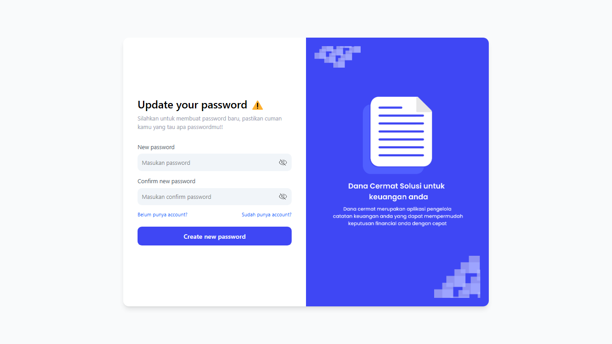</td>
    <td></td>
    <td>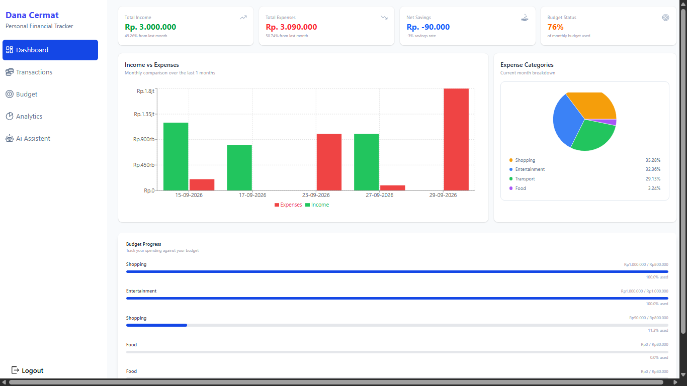</td>
  </tr>
  <tr>
    <td>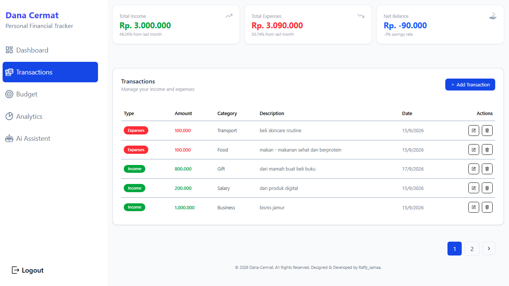</td>
    <td>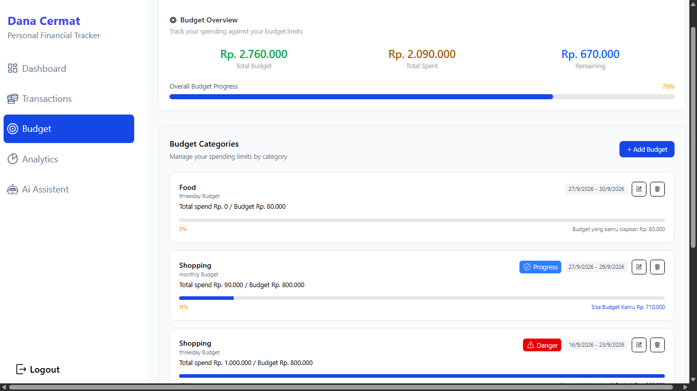</td>
    <td>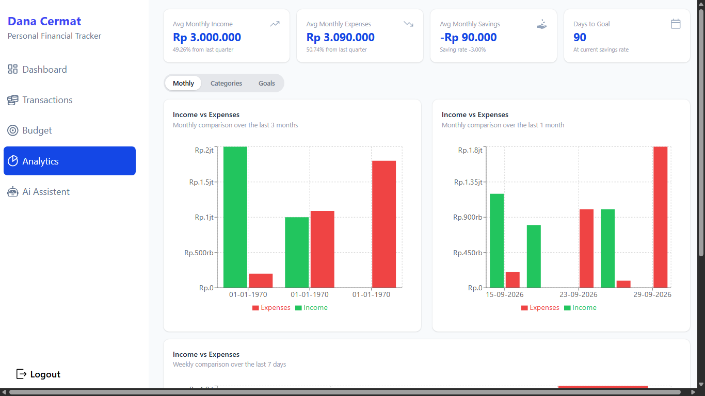</td>
  </tr>
  <tr>
    <td>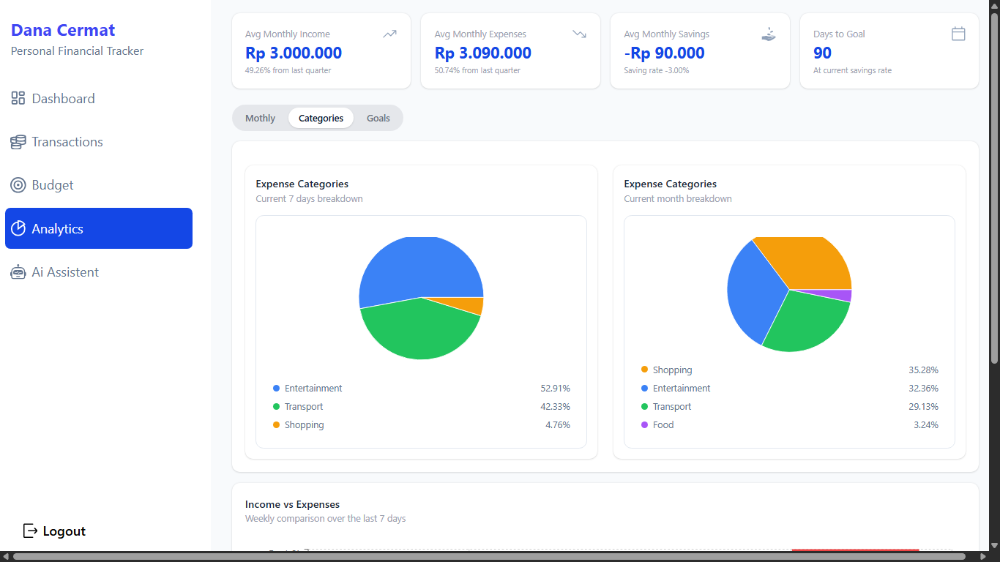</td>
    <td>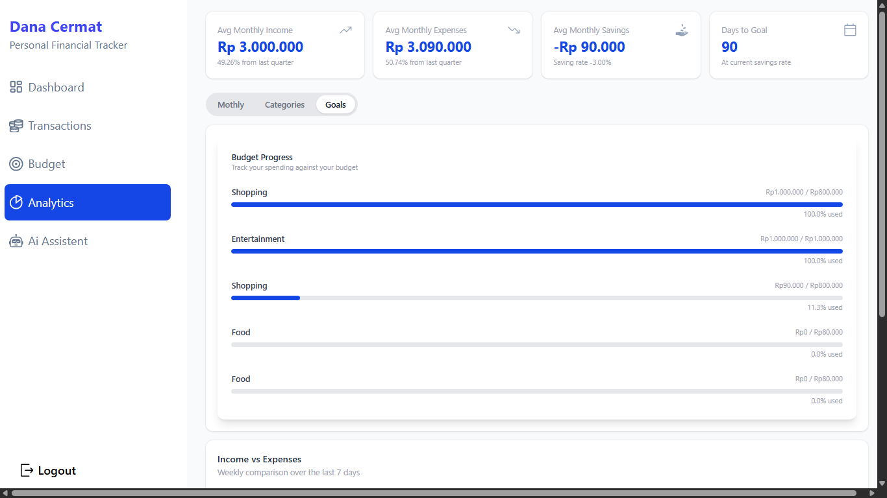</td>
    <td>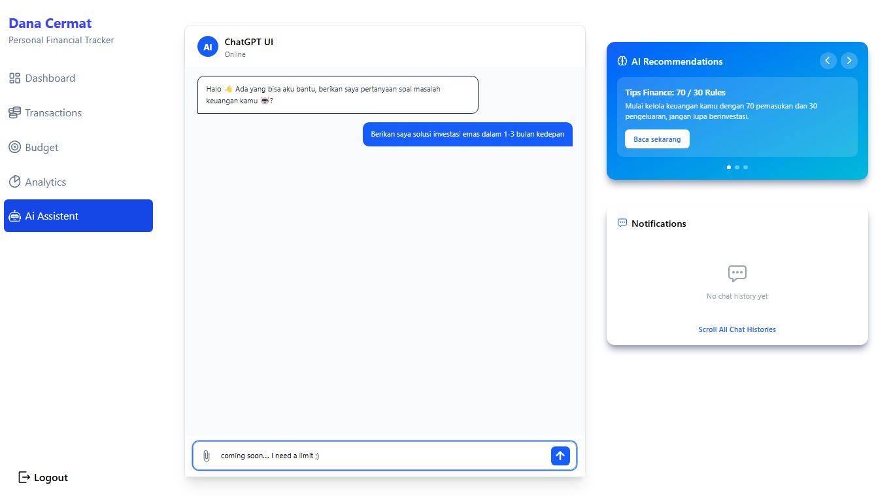</td>
  </tr>
  <tr>
    <td>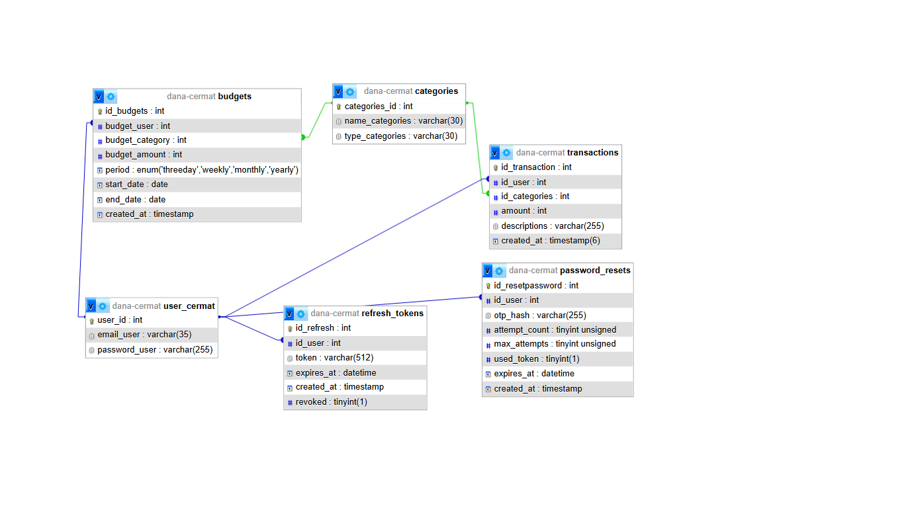</td>
    <td></td>
  </tr>
</table>

<!-- TODO: ganti alt text "Screenshot N" jadi deskripsi, misal "Login page", "Dashboard" -->


## 🛠️ Tech Stack

| Layer | Technology |
|---|---|
| Frontend | React.js, Tailwind CSS, React Hook Form, Zod, Recharts |
| Backend | Node.js, Express.js (REST API) |
| Database | MySQL |
| Auth | JWT, Sessions, OAuth, bcrypt |
| Email | SMTP (Nodemailer) |
| Architecture | MVC |

## 🏗️ Architecture

The backend follows the **MVC pattern**:

```
dana-cermat/
├── client/              # React frontend
│   └── src/
├── server/              # Express backend
│   ├── controllers/
│   ├── models/
│   ├── routes/
│   └── config/
└── database/
    └── schema.sql
```

<!-- TODO: sesuaikan struktur folder dengan repo lo -->

### Database Schema


<!-- TODO: sesuaikan tabel & kolom dengan schema aslinya -->

## 🚀 Getting Started

### Prerequisites

- Node.js >= 18
- MySQL >= 8

### Installation

```bash
# 1. Clone the repo
git clone https://github.com/<username>/dana-cermat.git
cd dana-cermat

# 2. Set up the database
mysql -u root -p < database/schema.sql

# 3. Install & run the backend
cd server
npm install
cp .env.example .env     # then fill in your credentials
npm run dev

# 4. Install & run the frontend (new terminal)
cd client
npm install
npm run dev
```

### Environment Variables

Create `server/.env`:

```env
PORT=5000
DB_HOST=localhost
DB_USER=root
DB_PASSWORD=your_password
DB_NAME=dana_cermat

# Auth
JWT_SECRET=your_jwt_secret
SESSION_SECRET=your_session_secret

# SMTP (forgot password email)
SMTP_HOST=smtp.gmail.com
SMTP_PORT=587
SMTP_USER=your_email@gmail.com
SMTP_PASS=your_app_password

# OAuth
GOOGLE_CLIENT_ID=your_client_id
GOOGLE_CLIENT_SECRET=your_client_secret
```

<!-- TODO: sesuaikan nama variabel dan provider OAuth dengan yang lo pakai -->


## 🗺️ Roadmap

- [x] Landing page
- [x] User authentication
- [x] Dashboard user
- [x] Transactions
- [x] Budgets
- [x] Analytics
- [X] Ai Assistance

## 🤝 Contributing

Contributions are welcome. Fork the repo, create a feature branch, and open a pull request.

## 👤 Author

**Raffy-samaa**
- GitHub: [@raffyalbar30](https://github.com/raffyalbar30)
- Instagram: [@raffy_samaa](https://www.instagram.com/raffy_samaa/)
- LinkedIn: [mohammadraffyalbar](https://www.linkedin.com/in/mohammadraffyalbar/)
- Back-end: [dana-cermat-be](https://github.com/raffyalbar30/dana-cermat-be)

---

<div align="center">
If this project helped you, consider leaving a ⭐
</div>
